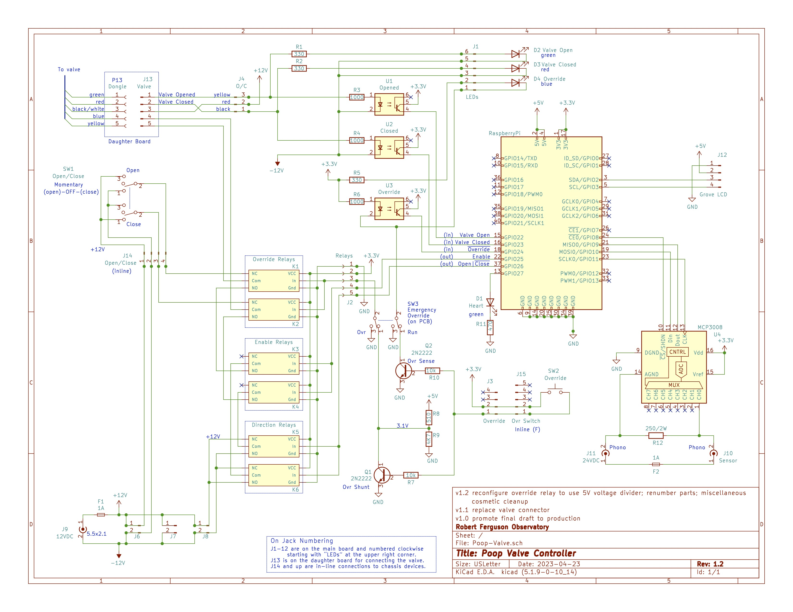
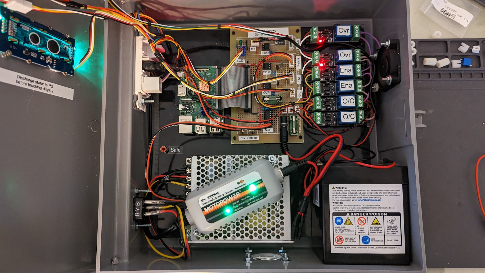

# poop-meter

Source code and design for the ultrasnoic septic tank monitor and main water shutoff.

* Doc: Documentation and technical notes.
* Deprecated Arduino and Perl code for the previous incarnation.
* Poop-Valve: Schematic for the water main shutoff valve.
* etc: Support files (Raspberry Pi startup script, crontab).
* src: Python source code.

## TL;DR

Tracks the depth of the effluent in the septic holding tank. Notifies a human (SMS text)
at intervals, more frequently as the tank gets more full.  Shuts off the main water valve
if the tank gets to a panic level.

## Detailed Design

Coming Real Soon Now.

